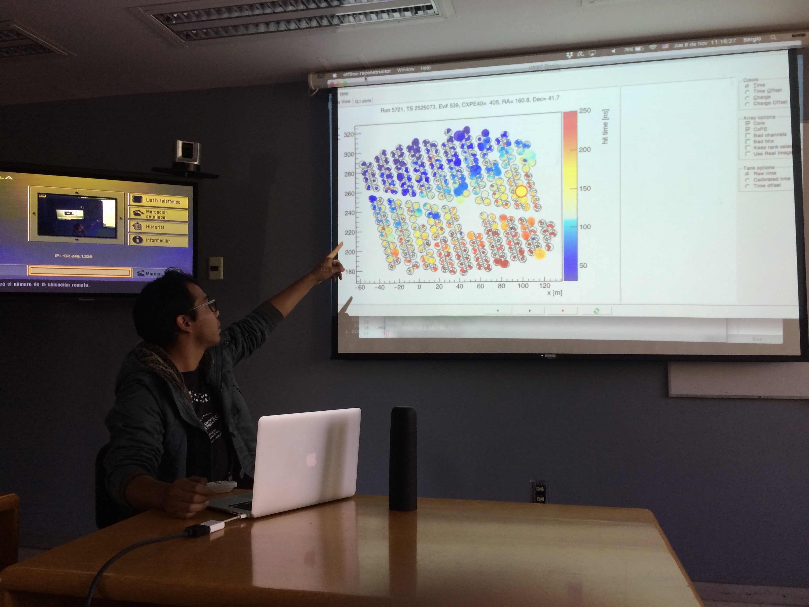
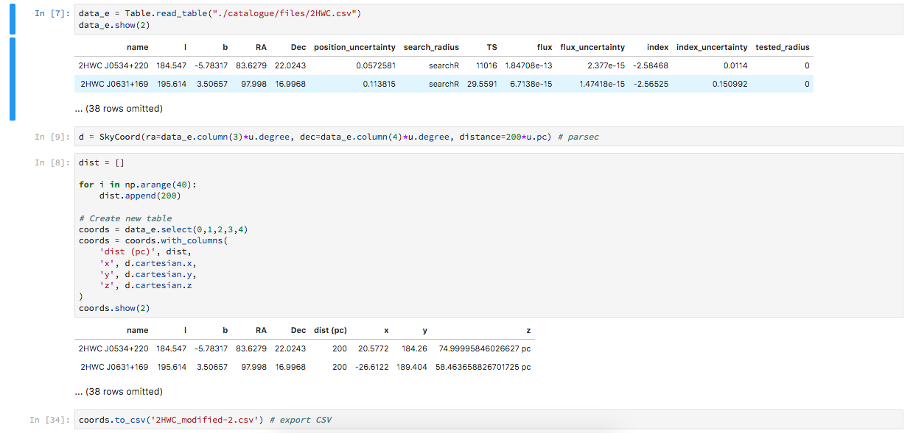
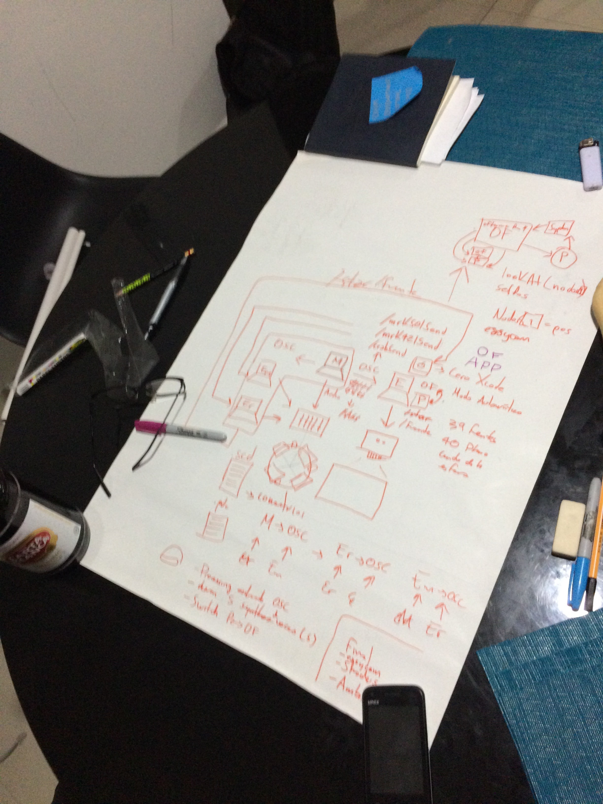
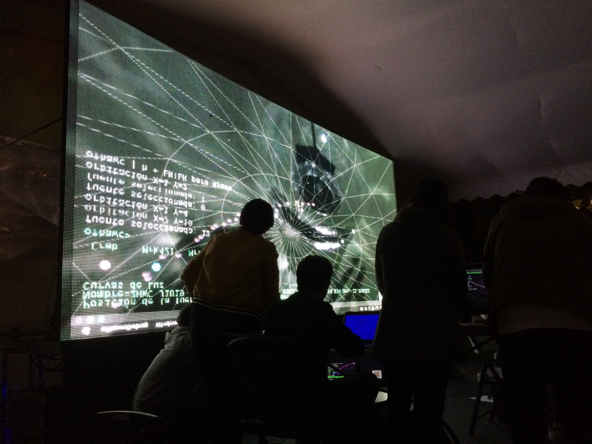

# The 2HWC HAWC Observatory Gamma-Ray Catalogue


This project does reference to the next github repositories:

  * [ofhawc](https://github.com/EmilioOcelotl/ofhawc) by Emilio Ocelotl.
  * [sc_hawc](https://github.com/marianneteixido/sc_hawc) by Marianne Teixido.

HAWC Observatory: [datasets](https://data.hawc-observatory.org/datasets.php)

  * Mention to Emmanuel Anguiano-Hernández [mecanosaurio](https://github.com/mecanosaurio).

---

## Home

- [Introduction](#Introduction)
- [Reconstruction](#Reconstruction)
- [Process](#Processes)
- [Methodology](#Methodology)
- [Essay](#Essay)
- [Presentation](#Presentation)
- [Tools](#Tools)
- [Python](#Python)
- [Processing](#Processing)
- [References](#References)

---

## Introduction

Each time of second, a certain gamma-ray particles that travels from the interstellar medium to earth's atmosphere, has been cascading our bodies. Perhaps, while we are reading this.  
At the beginning, these particles comes mostly from cosmic-ray sources, like; kilonovaes, pulsars, star collisions or galaxies' centers. When its hits in the atmosphere and interact with the atomic nuclei, elementary particles are produced, which turns it into more particles and generate a cascade effect. This showers of particles grows until all the energy of the original gamma-ray is totally used. You might imagine all this happening approximately at 10 km above sea level, and that could cover an area of even a 1,000 of square meters.  
So, [The High-Altitude Water Cherenkov (HAWC) Gamma-Ray Observatory](https://www.hawc-observatory.org/) attends this wonderful research on the [flanks](https://goo.gl/maps/c28eBSnLGy92) of the Sierra Negra volcano on Pico de Orizaba's (Citlaltépetl) National Park near from the beautiful city of Puebla in México. It implements a 140x180m territorial area with 300 cylindrical modules of 7.3x4.5m filled with 200,000L of purified water and three floating photomultiplier tubes (PMT) each.  
Now, When an elementary particle of the atmosphere cascade travels through the water, it produces a light pulse call Cherenkov radiation. This happens when charged electric particle travels faster than light in a medium like water. It is similar when at the poles of the planets experiences the auroras borealis or autralis, because of the protection role of the atmosphere from the higher levels of gamma-ray or radiation.


Thereby, the light pulses are detected by the photocathode material of the PMT which converts and multiply the signal from the photon particle into many electrons that sends an electricmagnetic pulse to 1,200 channels from 120 front-end boards in the observatory to process those into interpretable datasets and store onto tabular representations with the information about arrive time and cascade's size.  
Finally, through this information and the data from the 2HWC HAWC Observatory Gamma-Ray Catalogue, we intented to figure out its dimension from its domain to synthesize a qualitive form, that could reveals and amplify cognitive structures of cosmic ray's spectrum into an inferencial patterns system, which allows to reconstruct the direction from the original gamma-ray source and estimates its energy, through a based-computer simulation that visualize and sonorize its nature.

[Go up](#Home)

---

## Reconstruction

For the pictorical and sound reconstructions of the phenomena, we wanna answer some of these questions:
  * From where the Gamma-Ray came from?
  * How a Gamma-Ray emmited from Crab Nebulae travels to Earth.
  * What is a Gamma-Ray cascade?
  * How does the modules detect these particles?
  * How does this information is create in the machine-system?
  * What is the sound representation of all this?

Also we are interested in explore the quantities of time from the cascade particles events of Gamma-Ray that allow us to infer the reconstruction of the trajectory angle.

The pictorical representation of the 39 Gamma-Ray sources from the 2nd HAWC Observatory Catalogue mapped into a 3D computer-based spherical coordinates system, might hope been integrate in the future, as many as possible, with mostly all of the aspects from the phenoma, like in a quantum resolution perhaps, with the work developed in the Astronomic Hackatón 2018 with [UNAM's Astronomy Institute](http://www.astroscu.unam.mx/IA/index.php?lang=es), Dr. Magda González, Sergio Hernández, and the founders of the summon Carles Tardío, Rodrigo Treviño, Leslie García and everyone who were involved in the support of the project.

[Go up](#Home)

---

### Processes

The process which describes the implementation of the prototypings starts as follows:

In the first day, we were summoned by [Art, Science, and Technology's (ACT)](http://artecienciaytecnologias.mx/) program in the wild México City to attend a series of talks and workshops in the Astronomy Institute headquarters in UNAM during the 6th, 7th and 8th of november from 10-14h and from 16-18h.  
We were introduced to the observatory, and physics foundations with a talk from Dr. Magda González about _Cosmic ray as a messengers from the universe_, to adapt our thoughts to the domain language.  
Most of chemical elements that represent Mendeleev's periodic table comes from out of the earth, in fact; certain elements have been produce from the human being activity. So we ask ourselfs, from where the hell comes all the matter?!

||||
| :-------------: |:-------------:| :-----:|
|  |  |  |

In a modern vision way, it looks likes that the fundamental particles, like quarks, electrons, neutrinos, muons, taus where ionized during the cooling and the acecelerate expanse of the universe since the Big bang. Once this particles became with a more complex structure, because of the gravity, the temperature and many other stuff, the firsts stars and galaxies started to bright.


After that, inside a laboratory they explained us how does it work, in general, the electronic system of the HAWC's Observatory. The most interest part, from my point of view, is when the Cherenkov's effect lights the photocathode in the tubes to photomultiply it into many electrons and send a signal to the engineering mechanisim where a front-end board recieve this pulse and translate it into bitcode, and then process it, with another machines-levels, to get the data in natural language.  

|||||
|:---:|:---:|:---:|:---:|
|||||

Then, we were on an underground laboratory where they showed us the purified quality water process of the modules with a lasser passing through a tube filled with dirty water.  

||||
|:---:|:---:|:---:|
|  |  |  |

At the end of the day, we had a nice exploration of the first Data Sets with Sergio Hernández, whom facilitated us to read each of the sets' parameters. For example, the 39 Gamma-Ray sources which allow them to plot the sky or the maps from the observation significance of each source or the lightcurves from Crab Nebulae, Markarian 421, and Markarian 501 from about 17 measuring months.  
The format of the data files is very important for the implementation of the project. In this case, the second catalogue is in .xml, but Sergio provided us a program to convert it to .csv with python. The lightcurves are in .dat so with a little help from my friend Emmanuel, we could solved the problem to reconstruct the data in readable format for the environments that we were used. There was a interested fact in the variables of this set, that Sergio helped us with the dates in which the flow started to record and it finished by converting the Modified Julian's Calendar to Gregorian's Calendar with some tricks from the Astropy.time module. Now, we were ready to ping some ideas with the community!  

||||
|:---:|:---:|:---:|
|  |  |  |

Finally, the mentors assigned to the mission presented their portfolios with conceptual tools from programming languages like SuperCollider, Pure Data, VVVV, OpenFrameworks and Processing, which it is intended to specify this aspects forward.

---

In the second day, we started in the cafeteria 2nd floor's Astronomy Institute to share some ideas with different points of view for what is supposted to be the final reconstruction from what we heard and felt previously. As a group, whom starts a problem since the begining, we decided to present it for the Stars' night international festival for the 17th of november in differents resolutions or scales: as a main in the interstellar medium, as a pre cascade in the earth's atmosphere and post cascade in the HAWC Observatory, and as a particular periodistic way.  

||||
|:---:|:---:|:---:|
|  |  |  |

In this photo my name appear with 'k' instead of 'c' and with '?', because at that time of the day I had to leave early the meeting. But definitely, I was agree with the idea about mapping the 39 gamma-ray sources using the galactic coordinates from the catalogue, because I decided to share with the community a sketch in which I'm recenlty working for my master's degree. And also, I was interested in the work proposed by Emilio and Marianne, about sending values through an Open Sound Control (OSC) Protocol cause it were a nice solution to integrate the work of everybody in a single presentation.


[Go up](#Home)

---

### Methodology

In the third day, we were ready to begin to sinthetyze the data. 



||||
|:---:|:---:|:---:|
|  | |  |

So at next, I propose a guide which could probably help or agile the winnings for the project:

#### 1. Check the database. 

#### 1.1. Determine which variables from the tabular representation we wanna use, why we are gonna used them and what is the purpose of it. The data is recolected from the electromagnetic pulse which sends the PMT floating in every single one of the modules. 

####  1.1.1. Pictorical and sound variables for the representation:

- Name of the celestial source.
- Galactical, ecuatorial and spherical coordinates.
- Distance of the object in parsecs.
- The transitory amplititude from the fluxtuation of the Crab Nebulae, Markarian 421, Markarian 501.
- Position of the camera inside the simulation.

#### 2. Matrix data process.
    
#### 2.1. Calculate cartesian coordinates to spherical for plotting a spheric radius.
        

        
#### 2.2. Convert ecuatorial coords to spherical for positioning the 39 gamma-ray sources.  
Here, I had the opportunity to reach Carles and Sergio knowledge by explaining the idea of galactical  coordinates and how to transformed them with again some tricks from Astropy module.




#### 2.3. Reconstruct the tabular representation from the lightcurves in .dat and export it to .csv.


#### 2.4. Parse all the datasets with every tool (SuperCollider, Processing, OpenFrameworks).


#### 3. Paint or graphic from the data.

#### 3.1. Plot a 3D sphere with Processing or OpenFrameworks.


#### 3.2. Position the 39 gamma-ray sources in the sphere.


#### 3.3. Model the sources with the transitory flux amplitude.


#### 3.4. Represent a gamma-ray sended from Crab Nebulae (pending).


#### 4. Implement OSC Protocol for the strokeWeight from SuperCollider.

```
OscP5 oscP5;
NetAddress myRemoteLocation;

float f_crab;
float f_mrk421;
float f_mrk501;
String typed = "";

void setup() {
    /* Start oscP5, listening for incoming messages at port 12000 */
    oscP5 = new OscP5(this, 12000);  
    /* myRemoteLocation is a NetAddress. a NetAddress takes 2 parameters,
    * an ip address and a port number. myRemoteLocation is used as parameter in
    * oscP5.send() when sending osc packets to another computer, device, 
    * application. usage see below. for testing purposes the listening port
    * and the port of the remote location address are the same, hence you will
    * send messages back to this sketch.
    */
    
    myRemoteLocation = new NetAddress("127.0.0.1", 12000); // Local
    //myRemoteLocation = new NetAddress("192.168.1.100", 5612); // Emilio
} //------------------------------------------------------------------------------------------------------ setup

void draw(){
  /* 
   * Draw 
   * GAMARAY SOURCES 
   * – pulsar, super nebulae, star collision, galaxy centers –
   */
  for (int i = 0; i < source.length; i++) {
    PVector v1 = source[i]; // PVector
    //----------------------------------------- The Sun at the center in color white
    stroke(255, 255, 0);
    strokeWeight(7);
    point(0, 0, 0); 
    if (i == 1) { //--------------------------------------------- Draw Crab Nebulae
      stroke(random(255), random(255), random(255));      
      strokeWeight(int(f_crab*5000));
      //strokeWeight(flux_crab[int(random(flux_crab.length))]);
      point(v1.x, v1.y, v1.z);
    } else {
      if (i == 7) { //------------------------------------------- Draw Markarian 421
        stroke(random(255), random(255), random(255));
        strokeWeight(int(f_mrk421*5000));
        //strokeWeight(flux_mrk421[int(random(flux_mrk421.length))]);
        point(v1.x, v1.y, v1.z);
      } else {
        if (i == 9) { //----------------------------------------- Draw Markarian 501
          stroke(random(255), random(255), random(255));
          strokeWeight(int(f_mrk501*5000));
          //strokeWeight(flux_mrk501[int(random(flux_mrk501.length))]);
          point(v1.x, v1.y, v1.z);
        } else { //-------------------------------------------- Draw the rest of the sources          
          stroke(random(255), 0, 255);
          strokeWeight(6);        
          point(v1.x, v1.y, v1.z);
        }
      }
    }
} //------------------------------------------------------------------------------------------------------ draw

void keyPressed() {  
  if (key == ENTER && typed.equals("3")) {
    /* in the following different ways of creating osc messages are shown by example */
    OscMessage myMessage = new OscMessage("/fuente");    
    myMessage.add(3); /* add an int to the osc message */

    /* send the message */
    oscP5.send(myMessage, myRemoteLocation);
  }  
} //------------------------------------------------------------------------------------------------------ keyPressed

/* incoming osc message are forwarded to the oscEvent method. */
void oscEvent(OscMessage theOscMessage) {
  /* parse theOscMessage and extract the values from the osc message arguments. */
  if (theOscMessage.addrPattern().equals("/crabSend")) {
    f_crab = theOscMessage.get(0).floatValue();
    //println("### values from /crabSend pattern: "+f_crab);
  } else {
    if (theOscMessage.addrPattern().equals("/mrk421Send")) {
      f_mrk421 = theOscMessage.get(0).floatValue();
      //println("### values from /mrk421Send pattern: "+f_mrk421);
    } else {
      if (theOscMessage.addrPattern().equals("/mrk501Send")) {
        f_mrk501 = theOscMessage.get(0).floatValue();
        //println("### values from /mrk501Send pattern: "+f_mrk501);
      }
    }
  }
  int firstValue = theOscMessage.get(0).intValue();
  println("\n### values from the osc message: "+firstValue);
  /* print the address pattern and the typetag of the received OscMessage */
  //println(" typetag: "+theOscMessage.typetag());
  println("### received an osc message. with address pattern: "+theOscMessage.addrPattern());
  println("### IP address: "+theOscMessage.address());
  println("### port: "+theOscMessage.port());
  println("### NetAddress: "+theOscMessage.netAddress());
} //------------------------------------------------------------------------------------------------------ oscEvent
```

|a|b|
|:---:|:---:|
|||

#### 5. Implement an Interactive User-Interfaced to control the exploration of the visualization (pending).


[Go up](#Home)

---

### Tools

There were certain suggested technology tools to handle the challenge for this project. Meanwhile, some were interested in visualize the phenomena, some were interested in sonorize it too. So at the moment, I decided to use a graphic library based on Java in a programming environment call Processing, and a matrix processor environment based on Python language call Jupyter Lab.

[Go up](#Home)

---

### Essay


[Go up](#Home)

---

### Presentation


||||
|:---:|:---:|:---:|
||||



[Go up](#Home)

---

## Python

  * [datasets/Hackaton2018.ipynb](datasets/Hackaton2018.ipynb): Data analysis with python.

Some docs from Astropy module that were used:

  * [astropy.coordinates](http://docs.astropy.org/en/stable/coordinates/index.html)
  * [astropy.time](http://docs.astropy.org/en/stable/time/index.html)
  * [astropy.io.fits](http://docs.astropy.org/en/stable/io/fits/)


[Go up](#Home)

---

## Processing

  * [visualization/HAWC_GammaRayCatalog/HAWC_GammaRayCatalog.pde](visualization/HAWC_GammaRayCatalog/HAWC_GammaRayCatalog.pde): Data visualization with Processing.

To adapat the strokeWeight of the sources `Crab Nebulae`, `Markarian 421` y `Markarian 501` to the OSC messages from SuperCollider, setup the port as follows:

```
Orb.start("192.168.1.111", 12000); // la dirección de la otra compu. Se necesita la   librería PiranhaLab
```

Then comment and uncomment the next lines in the Processing code:

```
strokeWeight(int(f_crab*1000));
/strokeWeight(flux_crab[int(random(flux_crab.length))]);

strokeWeight(int(f_mrk421*1000));
//strokeWeight(flux_mrk421[int(random(flux_mrk421.length))]);

strokeWeight(int(f_mrk501*1000));
//strokeWeight(flux_mrk501[int(random(flux_mrk501.length))]);
```

Now, you can run the app while SuperCollider is running too!

[Go up](#Home)

---
### References

https://es.wikipedia.org/wiki/Fotomultiplicador

http://artecienciaytecnologias.mx/

https://www.hawc-observatory.org/

https://historiaybiografias.com/calendario/

https://www.nochedelasestrellas.org.mx/

http://opensoundcontrol.org/

http://www.astroscu.unam.mx/IA/index.php?lang=es

https://processing.org/

[Go up](#Home)

---

